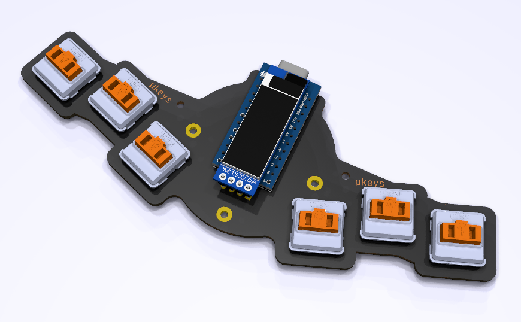

# Microkeys

## Install

* `git clone --recurse-submodules git@github.com:alexanderbrevig/microkeys`
* `make`
* # make your mods

This will generate a stub PCB that I modified to get to the final design.

## REFs

https://splitkb.com/
https://fkcaps.com/?a=FlatFootFox
https://flatfootfox.com/ergogen-introduction/
